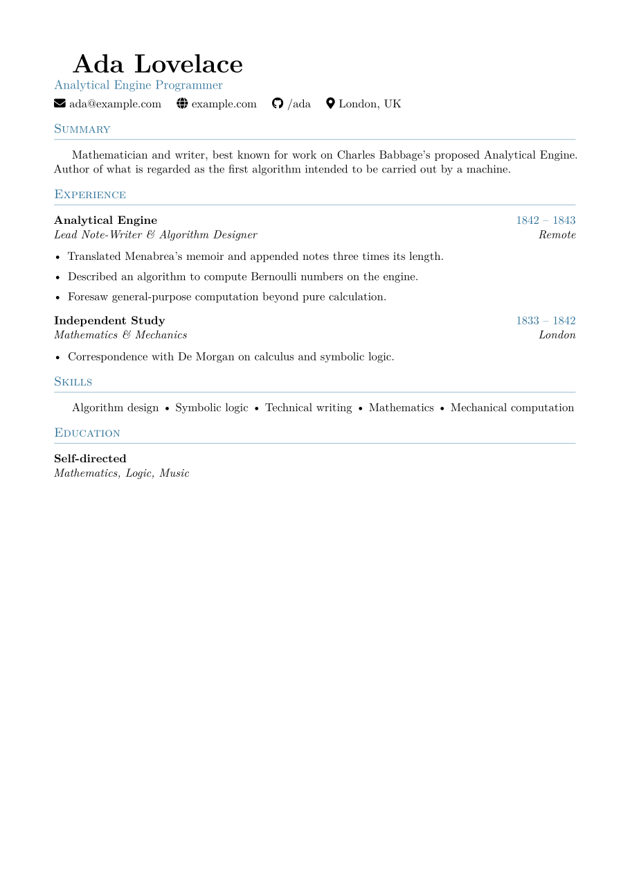
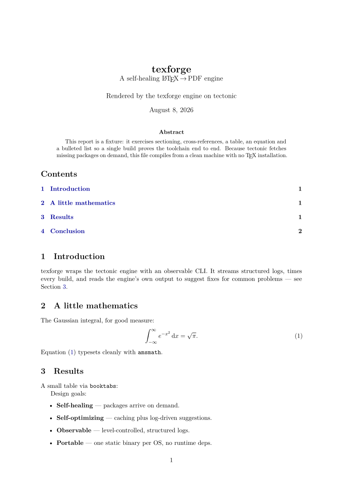
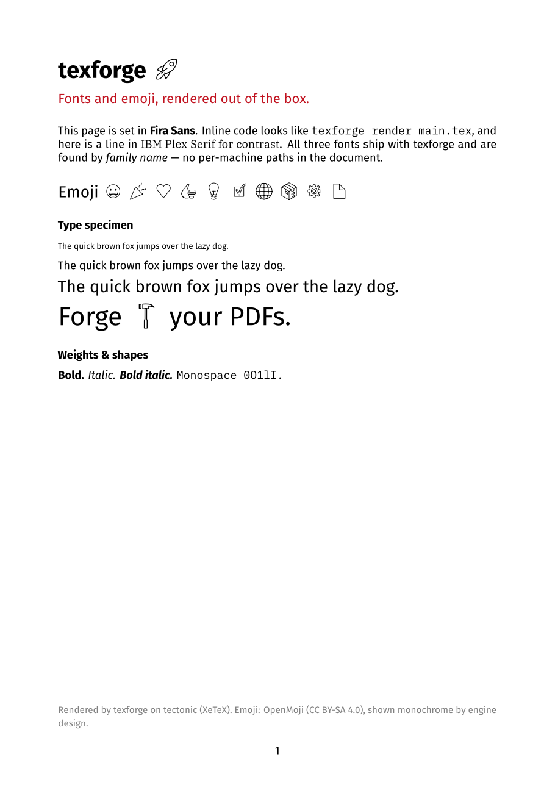
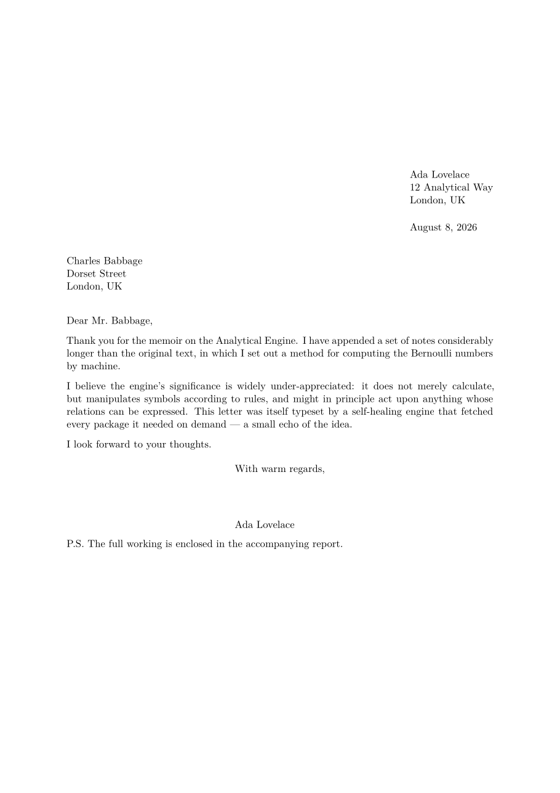
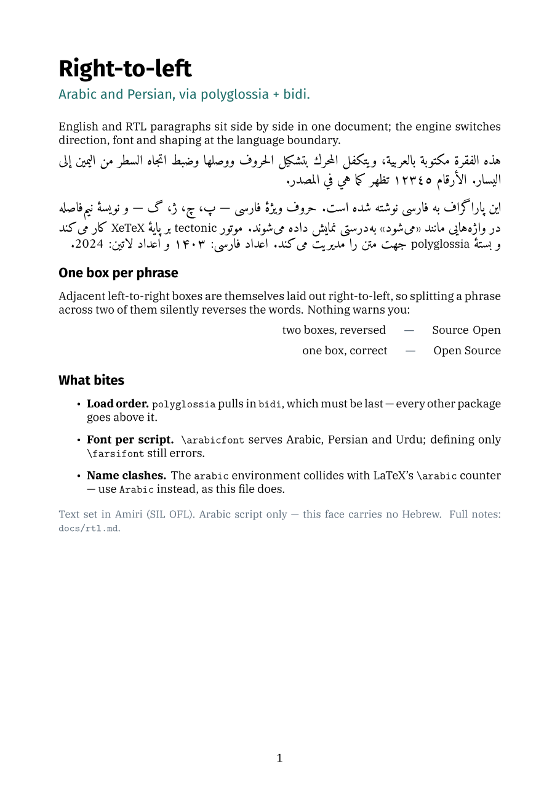
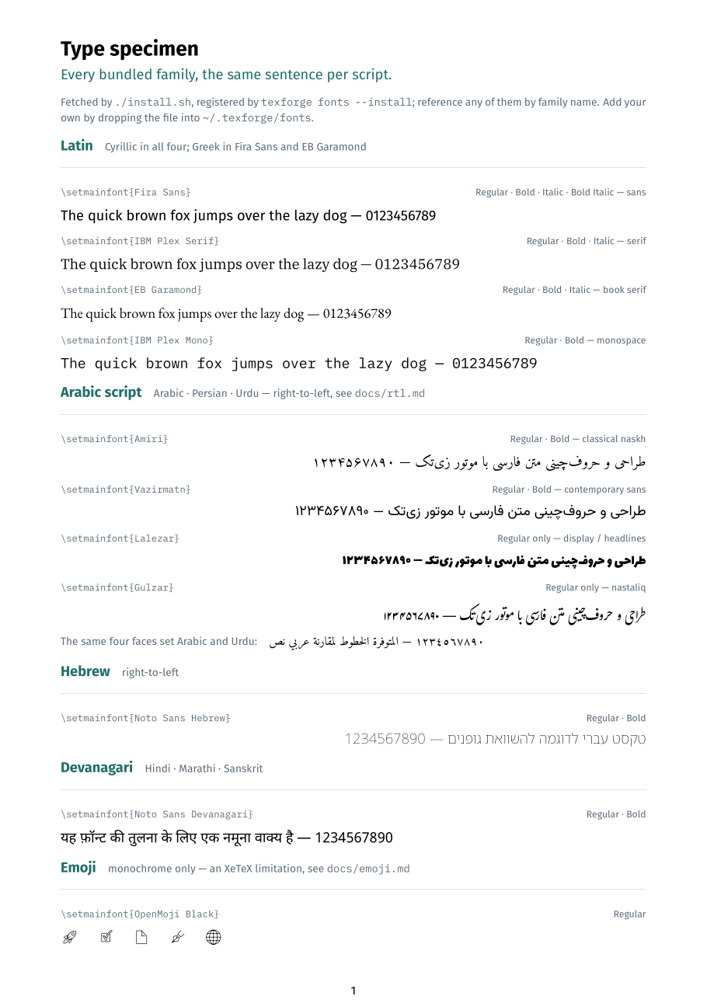

<h1 align="center">texforge</h1>
<p align="center"><b>A self-healing LaTeX → PDF engine.</b><br>
One static binary, zero system TeX, packages fetched on demand.</p>

---

texforge is a small, observable wrapper around
[**tectonic**](https://tectonic-typesetting.github.io/) (a modern, XeTeX-based
TeX engine shipped as a single binary). You point it at a `.tex` file; it
produces a PDF — fetching any missing LaTeX packages automatically the first
time it needs them, then caching them.

- **Self-healing** — missing packages are downloaded on demand, no `tlmgr`, no full TeX Live.
- **Self-optimizing** — a warm package cache plus incremental/watch builds, and a log analyzer that reads each build and *suggests fixes*.
- **Observable** — level-controlled, structured logs; per-build timing; a machine-readable `texforge.log.jsonl`.
- **Portable** — one dependency-free binary per OS (macOS, Linux, Windows), Apple-Silicon native.
- **Standard-compatible** — it's real XeLaTeX under the hood, so most existing templates just work.

## Quickstart

```sh
git clone https://github.com/m3di/texforge.git && cd texforge
./install.sh                              # fetches tectonic + CLI + fonts (~/.texforge)
~/.texforge/bin/texforge render examples/report/main.tex
```

That's clone → install → render. The first build downloads the tectonic support
bundle (a minute or so); every build after is fast. On Windows, use
`powershell -ExecutionPolicy Bypass -File install.ps1`.

> Add `~/.texforge/bin` to your `PATH` and it's just `texforge render …`.

## Demo gallery

Every PDF below was rendered by texforge itself, from the sources in
[`examples/`](examples/). Click a preview for the PDF.

<table>
<tr>
<td width="50%" align="center">
  <a href="examples/resume/output/main.pdf"><br><b>Résumé / CV</b></a><br>
  <sub>icons (fontawesome), accent colour, custom section rules</sub>
</td>
<td width="50%" align="center">
  <a href="examples/report/output/main.pdf"><br><b>Report / article</b></a><br>
  <sub>TOC, cross-refs, equations, booktabs table, hyperlinks</sub>
</td>
</tr>
<tr>
<td width="50%" align="center">
  <a href="examples/showcase/output/main.pdf"><br><b>Fonts &amp; emoji</b></a><br>
  <sub>bundled fonts by name + monochrome emoji</sub>
</td>
<td width="50%" align="center">
  <a href="examples/letter/output/main.pdf"><br><b>Formal letter</b></a><br>
  <sub>the standard <code>letter</code> class</sub>
</td>
</tr>
<tr>
<td width="50%" align="center">
  <a href="examples/rtl/output/main.pdf"><br><b>Right-to-left</b></a><br>
  <sub>Arabic &amp; Persian via polyglossia + bidi, mixed with Latin</sub>
</td>
<td width="50%" align="center">
  <a href="examples/specimen/output/main.pdf"><br><b>Type specimen</b></a><br>
  <sub>every bundled family, the same sentence per script</sub>
</td>
</tr>
</table>

## Usage

```
texforge <command> [flags]

  render <file.tex>   Compile to PDF (alias: build)
  watch  <file.tex>   Compile, then rebuild on every change
  clean  [dir]        Remove intermediate/aux files (PDFs kept; --all also logs)
  analyze <log>       Read an engine log and suggest fixes
  doctor              Check engine, fonts and config are healthy
  fonts [--install]   List bundled fonts, or register them by name
  version             Print texforge and tectonic versions
```

**Controllable behaviour** (render/watch):

| flag | effect |
|---|---|
| `-o, --output <dir>` | output directory (default `output`) |
| `-n, --name <name>` | output PDF basename (default: input's name) |
| `-v, --verbose` / `-q, --quiet` | log level |
| `--clean` | delete intermediates after a successful build |
| `--no-fonts` | don't expose bundled fonts to the engine |
| `--runs <n>` | force exactly *n* engine passes (`0` = auto) |
| `--config <file>` | use a specific `texforge.toml` |
| `-- <args…>` | everything after `--` is passed straight to tectonic |

Example — build `cv.tex` to `dist/ada.pdf`, quietly, with SyncTeX for your editor:

```sh
texforge render cv.tex -o dist -n ada -q -- --synctex
```

### Config file

Defaults live in a `texforge.toml` found by walking up from your document — so
one file at a repo root serves every document under it. CLI flags always win.
See [`texforge.toml.example`](texforge.toml.example):

```toml
input     = "main.tex"
output    = "output"
verbosity = "info"
watch     = false
engine_flags = ["--synctex"]
```

## Fonts & emoji

The installer fetches a small, freely-licensed font bundle into `~/.texforge/fonts` and registers it in your OS
font directory, so documents can reference fonts **by family name** on any OS:

```latex
\usepackage{fontspec}
\setmainfont{Fira Sans}
\setmonofont{IBM Plex Mono}
\newfontface\emoji{OpenMoji Black}
Ship it \emoji{\char"1F680}      % 🚀
```

| script | bundled families |
|---|---|
| Latin (Cyrillic throughout; Greek in Fira Sans and EB Garamond) | **Fira Sans** · **IBM Plex Serif** · **EB Garamond** · **IBM Plex Mono** |
| Arabic, Persian, Urdu | **Amiri** (naskh) · **Vazirmatn** (sans) · **Lalezar** (display) · **Gulzar** (nastaliq) |
| Hebrew | **Noto Sans Hebrew** |
| Devanagari (Hindi, Marathi, Sanskrit) | **Noto Sans Devanagari** |
| Emoji | **OpenMoji Black** (monochrome — see below) |

The [type specimen](examples/specimen/output/main.pdf) sets one sentence per
script in every one of them, side by side, with the `\setmainfont{…}` line to
copy — render it yourself with
`texforge render examples/specimen/main.tex`.

Run `texforge fonts` to list what's bundled, `texforge fonts --install` to
(re)register it. Drop your own `.ttf`/`.otf` into `~/.texforge/fonts` and
reinstall to add more.

> **Fonts texforge cannot ship.** The bundle is limited to freely
> redistributable faces. Commercial ones — the Persian **B-series** (B Nazanin,
> B Titr, B Yas, B Mitra, B Zar), IRANSans, and the like — are licensed, so
> install them yourself: drop the files into `~/.texforge/fonts`, run
> `texforge fonts --install`, and they resolve by family name exactly like the
> bundled ones. CJK is left out for size rather than licence — the Noto CJK
> families run to tens of megabytes each; install one the same way if you need it.

> **Emoji are monochrome — by engine design.** tectonic is XeTeX-based, and
> XeTeX cannot rasterize *colour* emoji fonts (neither bitmap `CBDT` like Noto
> Color Emoji, nor `COLR`): they come out blank. texforge therefore bundles
> **OpenMoji Black**, an outline font that renders as crisp black glyphs. If you
> need full-colour emoji, include them as images instead — that's outside the
> XeTeX text path. See [the note in `docs/`](docs/emoji.md).

> **Right-to-left works, with sharp edges.** Arabic and Persian typeset
> correctly via `polyglossia` + `bidi` — but `polyglossia` must be the *last*
> package you load, the font is chosen per **script**
> (`\newfontfamily\arabicfont{...}`, not per language), `\begin{arabic}`
> collides with LaTeX's `\arabic` counter (use `Arabic`), and Latin words inside
> RTL text belong in `\textenglish{}` — a whole phrase per box, or they come out
> reversed. **Amiri**, **Vazirmatn**, **Lalezar** and **Gulzar** are bundled for
> Arabic script and **Noto Sans Hebrew** for Hebrew; see the
> [example](examples/rtl/main.tex) and [`docs/rtl.md`](docs/rtl.md).

## Observability & the issue-finder

Every build is timed and logged. With `keep_logs` on (default), a structured
`output/texforge.log.jsonl` is written that you can grep or feed back in:

```sh
texforge analyze output/texforge.log.jsonl
```

The analyzer recognises common failure and inefficiency signatures — missing
package, undefined control sequence, font-not-found, missing image, unresolved
`\ref`/`\cite`, overfull/underfull boxes, multiply-defined labels, name
collisions, and RTL/`bidi` setup mistakes — and prints a plain-language
**suggestion** for each. It runs automatically after every build:

```
error Undefined control sequence (×2)
  ↳ A command is used before it is defined — usually a missing \usepackage.
    The offending macro is shown on the 'l.<n>' line just below in the log.
```

## Why these choices

- **tectonic, not pdflatex + a full TeX Live / Docker.** tectonic is one
  self-contained binary that fetches only the packages a document actually uses
  and caches them — no multi-gigabyte install, no container, native on
  Apple Silicon. That *is* the self-healing property.
- **A Go CLI, not a shell/Python pair.** The wrapper compiles to a single static
  binary with **no runtime dependencies** — nothing to install on Windows, no
  Python version to chase — mirroring tectonic's own philosophy. It also makes
  the structured logging and log analysis first-class instead of `grep` glue.
  Cross-compilation to every OS/arch is a one-liner (see the release workflow).

## Install options

| method | command |
|---|---|
| bundled installer (recommended) | `./install.sh` · `install.ps1` |
| Homebrew (engine only) | `brew install tectonic`, then `go build ./cmd/texforge` |
| from source | `go build -o texforge ./cmd/texforge` (needs the tectonic binary on `PATH` or in `~/.texforge/bin`) |
| prebuilt CLI | grab `texforge_<os>_<arch>` from [Releases](https://github.com/m3di/texforge/releases) |

`texforge doctor` verifies the whole setup and tells you what's missing.

## Layout

```
cmd/texforge/      the CLI (commands, flags, watch loop)
internal/engine/   tectonic invocation, timing, output capture
internal/analyzer/ the log-driven issue-finder
internal/config/   texforge.toml + defaults + flag merge
internal/logx/     structured, level-controlled logging
internal/assets/   engine/font discovery, OS font-dir install
examples/          the demo templates (rendered PDFs committed)
install.sh / .ps1  cross-OS installers
```

## License

MIT — see [LICENSE](LICENSE). Bundled fonts keep their own licenses (SIL OFL for
Fira Sans, IBM Plex, EB Garamond, Amiri, Vazirmatn, Lalezar, Gulzar and the Noto
families; CC BY-SA 4.0 for OpenMoji). texforge builds on the
tectonic project (MIT).
